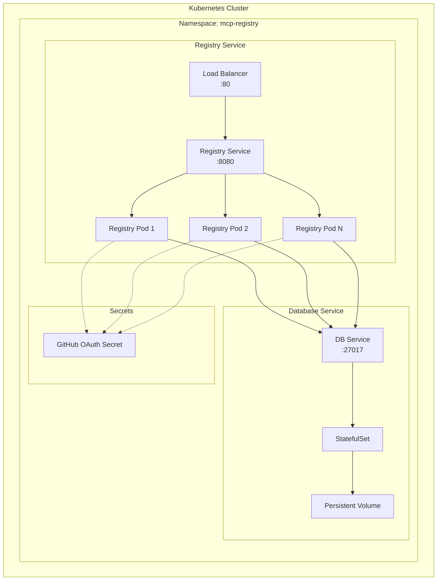
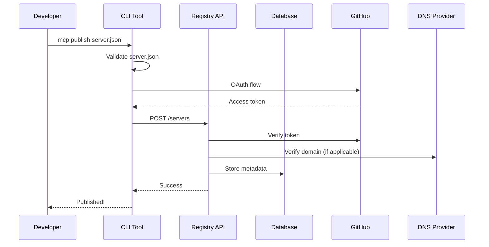
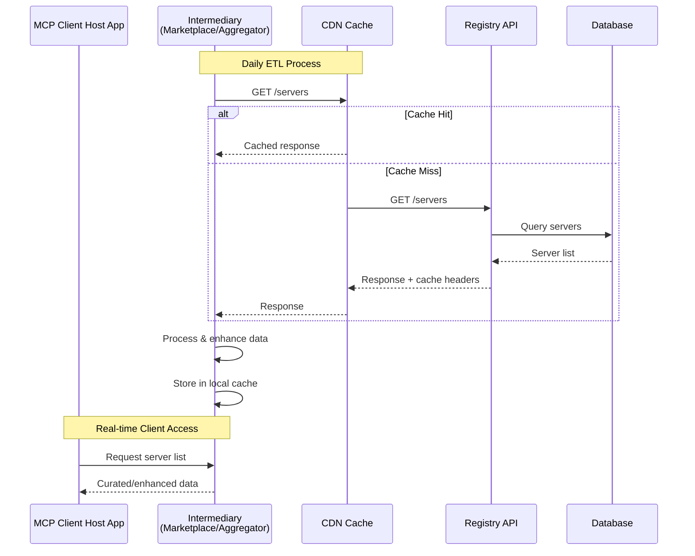
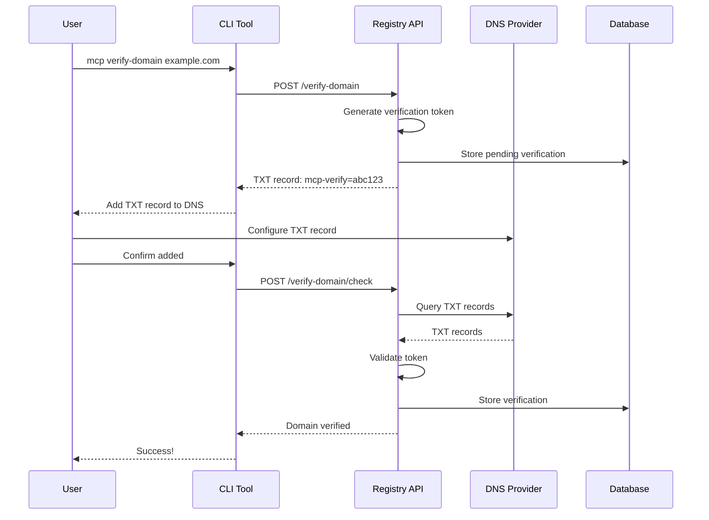
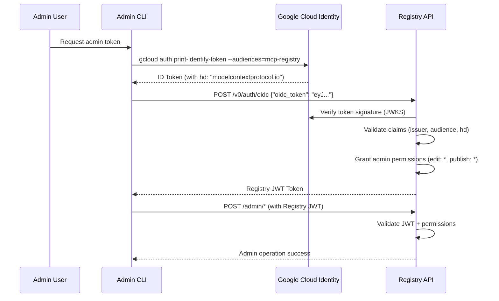

# MCP Registry Technical Architecture

This document describes the technical architecture of the MCP Registry, including system components, deployment strategies, and data flows.

## System Overview

The MCP Registry is designed as a lightweight metadata service that bridges MCP server creators with consumers (MCP clients and aggregators).

## Core Components

### REST API (Go)

The main application server implemented in Go, providing:
- Public read endpoints for server discovery
- Authenticated write endpoints for server publication
- GitHub OAuth integration (extensible to other providers)
- DNS verification system (optional for custom namespaces)

### Database (PostgreSQL)

Primary data store for:
- Versioned server metadata (server.json contents)
- User authentication state
- DNS verification records

### CDN Layer

Critical for scalability:
- Caches all public read endpoints
- Reduces load on origin servers
- Enables global distribution
- Designed for daily consumer polling patterns

### CLI Tool

Developer interface for:
- Server publication workflow
- GitHub OAuth flow
- DNS verification

## Deployment Architecture

### Kubernetes Deployment (Helm)

The registry is designed to run on Kubernetes using Helm charts:



## Data Flow Patterns

### 1. Server Publication Flow



### 2. Consumer Discovery Flow



### 3. DNS Verification Flow



### 4. Admin OIDC Authentication Flow

For registry administration, users with @modelcontextprotocol.io Google Cloud Identity accounts can authenticate using OIDC:



**Usage:**
```bash
# Get Google Cloud Identity token
ID_TOKEN=$(gcloud auth print-identity-token)

# Exchange for Registry JWT token  
REGISTRY_TOKEN=$(curl -X POST /v0/auth/oidc \
  -H "Content-Type: application/json" \
  -d '{"oidc_token": "'$ID_TOKEN'"}' | jq -r .registry_token)

# Use for admin operations
curl -H "Authorization: Bearer $REGISTRY_TOKEN" /v0/...
```